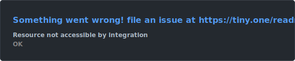

### Olá, eu sou o Diego! 👋

**Estudante de Ciência da Computação (UNESC) | Desenvolvedor Júnior | Migrando para Computação Quântica**
*Base em Backend & Mobile (Java, Spring Boot, Android) · Explorando Qiskit, álgebra linear e algoritmos quânticos*

---

### 🚀 Sobre Mim

Sou estudante de Ciência da Computação, ainda no início de carreira como desenvolvedor júnior — construindo projetos completos como forma de aprender na prática, do banco de dados à experiência no app. Hoje estou redirecionando esse foco para **computação quântica**, com o objetivo de seguir para uma pós-graduação na área.

Estudo os fundamentos matemáticos da computação quântica (Woody III → Nielsen & Chuang) e algoritmos como **Grover**, **Shor** e **QPE**, documentando tudo publicamente. Minha afinidade com matemática tem me levado para subáreas teóricas como teoria da informação quântica e correção de erros quânticos.

---

### 🧪 Computação Quântica

| Foco atual | Status |
|---|---|
| Essential Mathematics for Quantum Computing (Woody III) | Em andamento |
| Nielsen & Chuang | Meta para o fim do ano |
| Algoritmos: Grover, Shor, QFT, QPE | Estudando padrões |
| [studying-quantum-computing](https://github.com/D-Hergesell/studying-quantum-computing) | Repositório público de notas e implementações (Qiskit) |

---

### 🛠️ Tech Stack

| **Backend** | **Mobile** | **Fundamentos & Pesquisa** | **Web** |
|---|---|---|---|
| Java · Spring Boot · REST APIs · JWT | Android nativo (Java) · QR Code · Offline-first | Álgebra Linear · Qiskit · Grafos · Dijkstra/Min-Heap | Next.js · TypeScript · React |
| PostgreSQL · NeonDB · Docker | | Git & GitHub | Tailwind · Framer Motion |

---

### 🏆 Projetos em Destaque

| Projeto | Descrição | Stack |
|---|---|---|
| [**Lista Smart API**](https://github.com/D-Hergesell/lista-smart-api) | Backend REST com JWT, gamificação por pontos/ranks e ingestão de NFC-e com resolução plug-and-play | `Java` `Spring Boot` `PostgreSQL` `JWT` `Docker` |
| [**Lista Smart Scanner**](https://github.com/D-Hergesell/ListaSmartScanner) | App Android para registro colaborativo de preços via QR Code, com sincronização offline/online | `Android` `Java` `QR Code` |
| [**Central de Compras**](https://github.com/D-Hergesell/trabalho-interdisciplinar) | Plataforma multi-perfil (admin/loja/fornecedor) — monorepo com API Spring Boot 3.5 e frontend Next.js/React 19 | `Java` `Spring Boot` `Next.js` `React` |
| [**Dijkstra — Capitais do Brasil**](https://github.com/D-Hergesell/dijkstra-capitais-brasil) | Caminho mais barato entre capitais usando Dijkstra com Min-Heap, custo de combustível + pedágio | `JavaScript` `Algoritmos` `Grafos` |
| [**Estudos de Computação Quântica**](https://github.com/D-Hergesell/studying-quantum-computing) | Repositório pessoal com fundamentos matemáticos, algoritmos e implementações em Qiskit | `Qiskit` `Python` |

---

### 📊 GitHub Stats

*(cards gerados automaticamente todo dia via GitHub Actions — veja `.github/workflows/update-readme-cards.yml`)*
